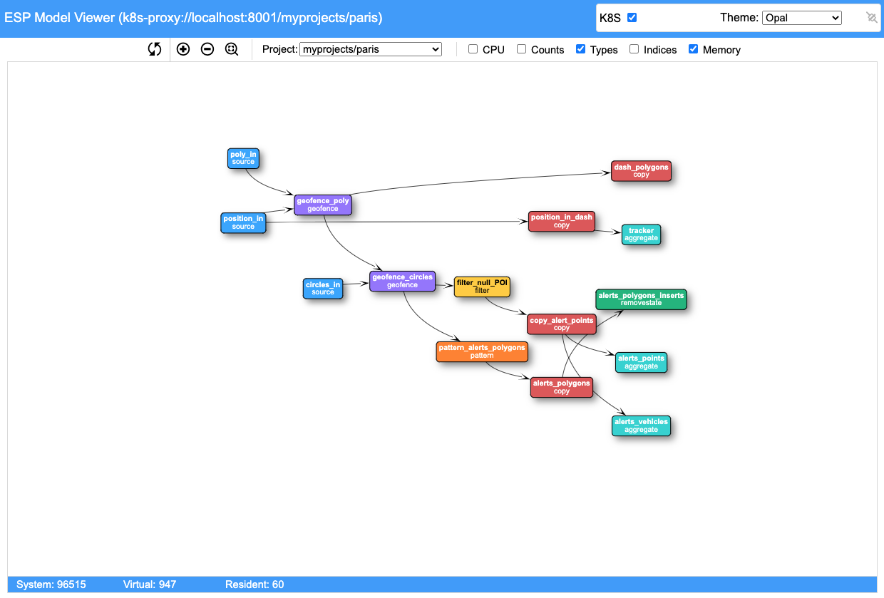

# SAS Event Stream Processing Javascript API

## Table of Contents

* [Overview](#overview)
    * [Prerequisites](#prerequisites)
    * [Installation](#installation)
* [Getting Started](#getting-started)
    * [Starting an HTTP Server](#Starting-an-HTTP-Server)
    * [Setting Up Your Page](#Setting-Up-Your-Page)
    * [Examples](#examples)
* [Using The API with Kubernetes](#Using-The-API-with-Kubernetes)
    * [K8S Introduction](#k8s-introduction)
    * [Using the UI with K8S](#Using-the-UI-with-K8S)
        * [Running the Examples](#Running-the-Examples)
        * [Model Viewer with K8S](#Model-Viewer-with-K8S)
        * [Log Viewer with K8S](#Log-Viewer-with-K8S)
* [Webpack](#Webpack)
    * [Introduction](#webpack_intro)
    * [Using with NodeJS](#webpack_nodejs)
    * [Using with Web Pages](#webpack_web)
* [Contributing](#contributing)
* [License](#license)
* [Example Pages](#example-pages)
* [Additional Resources](#additional-resources)

## Overview
The ESP Connect API allows you to communicate with ESP servers from any platform using Javascript objects. These objects can be easily embedded within web pages, and they
also support [Node.js](http://www.nodejs.org) so that they can also be run from the command line.

The API works with ESP standalone servers (such as simple command line startup) as well as with the [ESP Kubernetes Cloud
Ecosystem](https://github.com/sassoftware/esp-kubernetes/tree/develop).

**NOTE** While esp-connect should work with an ESP 6.2 server, it was designed specifically to work with the ESP 7.x+ websocket interface.

The Connect API leverages the new ESP websocket API which uses the following connection request
```
ws://espsrv01:7777/eventStreamProcessing/v1/connect
```
however the lower level details of the websocket communications are hidden from the user of the API.

The API includes both objects used for ESP communication as well as graphical objects used to display the ESP data.

Some of the graphical features include:
* Charts (built on [Plotly](https://plot.ly/javascript))
    * Bar Charts
    * Line Charts
    * Pie Charts
    * Radar Charts
    * Polar Charts
    * Bubble Charts
    * Time Series
    * Geographic Maps
        * Leaflet based maps (built on [Leaflet](https://leafletjs.com))
        * Plotly based maps (built on [Plotly](https://plotly.com/javascript/maps))
        * Choropleth maps (built on [Plotly](https://plotly.com/javascript/choropleth-maps))
    * Gauges
    * Compasses
    * Image Viewers
    * Tables
* ESP Model Viewers (built on [vis.js](https://visjs.org)) provide the ability to
    * Visualize the directed graphs used by ESP models.
    * Monitor server memory usage (system, virutal, and resident).
    * Monitor CPU usage on a per window basis as events stream through the models
    * Publish events into ESP models
    * See different window attributes including
        * CPU Usage
        * Event Count
        * Window Type
        * Window Schema
        * Index Type
* ESP Log Viewers provide the ability to 
    * See the ESP server log in realtime over a websocket interface
    * View and set the logging levels in the server
    * Copy the log to the clipboard
    * Filter the logs

You can read more about these visuals <a href="doc/visualizations.md" target="_blank">here</a>.

There is a full set of examples you can use to get started using the API.

In the case of a lost connection to the ESP server, all graphics should be cleared and the system will automatically begin attempting to reconnect. When the connection
is reestablished, the visualizations should continue displaying the data.

### Prerequisites

In order to run the ESP connect command line utilities you will need to have [Node.js](https://nodejs.org) (at least version 12.x) and [Node Package Manager](https://www.npmjs.com) installed on your machine.

### Installation

Once you have cloned this repository, you can use the API to develop web pages. If you want to use the NodeJS support
in the API, you must perform an *npm install* of the connect API (the *work* directory is where you cloned the API):
* change to your HOME directory.
* Install the Connect API from the directory where you cloned it (the module name is <i>esp-connect</i>):
```
$ npm install @work@/js/connect
```
* change directory to *@work@/node*.
* run a test using the following command (use your own ESP server):
```
$ node model.mjs --server http://espsrv01:7777
```

## Getting Started

### Starting an HTTP Server
Since this API includes graphical elements an HTTP server is required to support this capability. Any HTTP server will work, but for simplicity and demonstration purposes 
the <a href="https://www.npmjs.com/package/http-server" target="_blank">NodeJS HTTP server</a> will be used.
To set up the js HTTP server with the Connect API, 
* Clone the connect API into a working directory, *@work@*
* Change directory to @work@
* Start the HTTP server (we will use port 33000):
```
$ http-server --port 33000
```

Once the HTTP server is running, you can develop web pages. 
 
Depending on the API features you want to use, you should add certain declarations to the head section of the page.

**NOTE** The following HTML fragments assume the pages reside 2 levels below the working directory. Your pages can reside anywhere in your server and the 
relative paths will change accordingly.

### Setting Up Your Page
If you want to use the basic charting capabilities, you should include the plotly declarations:
```html
<script src="https://cdn.plot.ly/plotly-latest.min.js" charset="utf-8"></script>
```

If you want to use the leaflet geographic map visualization, you should include the leaflet declarations:
```html
<link rel="stylesheet" href="https://cdnjs.cloudflare.com/ajax/libs/leaflet/1.6.0/leaflet.css" integrity="sha512-xwE/Az9zrjBIphAcBb3F6JVqxf46+CDLwfLMHloNu6KEQCAWi6HcDUbeOfBIptF7tcCzusKFjFw2yuvEpDL9wQ==" crossorigin=""/>
<script src="https://cdnjs.cloudflare.com/ajax/libs/leaflet/1.6.0/leaflet.js" integrity="sha512-gZwIG9x3wUXg2hdXF6+rVkLF/0Vi9U8D2Ntg4Ga5I5BZpVkVxlJWbSQtXPSiUTtC0TjtGOmxa1AJPuV0CPthew==" crossorigin=""></script>
```

If you want to use the model viewer visualizations, include the vis.js declarations:
```html
<script src="https://visjs.github.io/vis-network/standalone/umd/vis-network.min.js"></script>
```

The following code must be added to bring in the Connect API:
```html
<script type="text/javascript">
var _esp = null;
</script>

<link rel="stylesheet" href="../../style/connect.css" />
<script type="module">
import {api} from "../../js/ui/main.js";
_esp = api;
</script>
```

**NOTE** The locations of the files will depend on the location of your page.

Now you should invoke some kind of *init* method when your page is loaded:
```html
<body onload="init()">
...
</body>
```

As an example, consider a web page that displays some colored areas and publishes events into an ESP model when the user clicks in these areas. The *init* function
might look like the following (be sure to enclose in the &lt;script&gt; tag):

```javascript
var _conn = null;
var _visuals = null;

function
init()
{
    _visuals = _esp.createVisuals(parms);
    _esp.handleLayout({layout:layout});

    var  model = "<project threads='4' pubsub='auto'>\
                   <contqueries>\
                     <contquery name='cq'>\
                       <windows>\
                         <window-source name='clicks' insert-only='true' index='pi_EMPTY'>\
                            <schema-string>id*:string,element:string,x:int32,y:int32</schema-string>\
                         </window-source>\
                         <window-copy name='copy'>\
                            <retention type='bytime_sliding'>30 seconds</retention>\
                         </window-copy>\
                         <window-aggregate name='clicksAggr'>\
                            <schema-string>element*:string,count:int32</schema-string>\
                            <output>\
                                <field-expr>ESP_aCount()</field-expr>\
                            </output>\
                         </window-aggregate>\
                       </windows>\
                       <edges>\
                         <edge source='clicks' target='copy' />\
                         <edge source='copy' target='clicksAggr' />\
                       </edges>\
                     </contquery>\
                   </contqueries>\
                </project>";

    _esp.showStatus("Loading project...");

    _esp.connect("http://espsrv01:2222",{ready:ready,error:error},{model:{name:"myproject",data:model},overwrite:true,force:_esp.getParm("force",false)});
}

function
ready(connection)
{
    _esp.clearStatus();
    _conn = connection;
    ...
}

```

This function creates a connection to an ESP server. You must provide a connection delegate to the connect call so that the the system can notify you when the connection has
been established. The connection delegate can implement the following methods:

* *ready* - invoked when the connection has been established and the handshake is complete
* *closed* - invoked when the connection has closed

It also includes a simple model to load upon establishment of the connection. If a project is specified in the connect call, the *ready* function
will not be called until the project is loaded.

The function also creates a Visuals object to be used later in creating the visualizations.

Now let's add a couple of visualizations to our page in the *ready* function:

```javascript
function
ready(connection)
{
    _esp.clearStatus();
    _conn = connection;

    _conn.getEventCollection({window:"myproject/cq/clicksAggr"}).then(
        function(collection) {
            _visuals.createBarChart("barchart",collection,{y:"count",header:"Clicks Chart",xrange:[0,100],orientation:"horizontal",get_color:barcolor});
            _visuals.createGauge("gauges",collection,{value:"count",segments:5,header:"Clicks Indicators",width:200,range:[0,100],bar_color:"rgba(255,255,255,.7)"});
        }
    );
}
```

**NOTE** If you are working with a server that already has a model loaded you may not need to go through the load process.

## Using The API with Kubernetes
### K8S Introduction
It is very easy to use the esp-connect package in a Kubernetes (K8S) environment. For starters you must create the ESP K8S ecosystem described
<a href="https://github.com/sassoftware/esp-kubernetes/tree/develop" target="_blank">here</a>.

You will need to communicate with a K8S API server in order to perform operations such as project creation and deletion. The preferred way to do this is to use a 
<a href="https://kubernetes.io/docs/tasks/extend-kubernetes/http-proxy-access-api" target="_blank">K8S proxy server</a>.

The proxy enables web-based components to communicate with K8S without experiencing issues with CORS (Cross Origin Resource Sharing).

**NOTE** You will need to download and install the <a href="https://kubernetes.io/docs/tasks/tools/install-kubectl" target="_blank">kubectl</a> command to 
run the proxy as well as perform other K8s-related tasks.

The kubectl command is used to start the proxy. The following starts a proxy which can be used to serve up the ESP connect web-based components including the examples, the model viewer, and the log viewer.
```javascript
$ kubectl proxy --www=@work@/esp-connect --www-prefix=/esp-connect --accept-hosts=".*" --disable-filter --v=7
```
The proxy reads your K8S configuration so it handles the authentication with the API server. You can communicate directly with the server (from command line not web page) but you will 
need to provide any necessary authentication info.

ESP server connections are initiated with URLs. For example, to retrieve the model for project trades from an ESP server running on espsrv01 at port 2222:
```
$ node model --server http://espsrv01:2222 --name trades
```
Since this points directly to an ESP server it will not suffice in a K8S environment.
A couple new protocols can be used to communicate with ESP servers in a K8S cluster.
* k8s: - protocol for going directly to a K8S API server.
```
$ node model --server k8s://10.104.16.129:6443/myns/trades
```
* k8s-proxy: - protocol for going to a K8S proxy server.
```
$ node model --server k8s-proxy://localhost:8001/myns/trades
```
The K8S url contains the host and port of the K8S server (or proxy) and optionally the K8S namespace and ESP project name.
The different protocols are necessary because communications with the proxy server do not use TLS whereas those with the API server do.

Using these protocols tells the connect API that it is working with K8S which will allow it to send any necessary requests to the
K8S server.

### Using the UI with K8S
#### Running the Examples
When you set up your K8S ESP environment, you specify a K8S namespace. Let's use a namespace called *myprojects* for demonstration
purposes. If you have run the setup scripts and have created that namespace, you can run the connect examples by specifying the
namespace in the URL (the following uses a local proxy server):
```
http://localhost:8001/esp-connect/examples/?namespace=myprojects
```

So if you bring up that page in a browser, the examples will use the K8S namespace to load and execute the necessary ESP models
for the examples.

#### Model Viewer with K8S
The model viewer has a checkbox in the upper right corner of the screen.



If you select this checkbox, you will go into K8S mode. This means that you do not connect directly to an ESP standalone server. The *Projects* dropdown
will be populated with all of the ESP projects that are residing in the K8S cluster (format is *namespace/project*). To switch between projects, you just
select the desired project from the dropdown and the API will communicate with K8S to get the model and display it.

To go back to standalone server mode, simply uncheck the checkbox. You will be prompted for a standalone server URL and connect in that manner.

#### Log Viewer with K8S
The log viewer has a checkbox in the upper right corner of the screen.


If you select this checkbox, you will go into K8S mode. This means that you do not connect directly to an ESP standalone server. There is also a  *Projects* dropdown
in the upper right corner In K8S mode.it be populated with all of the ESP projects that are residing in the K8S cluster (format is *namespace/project*). 
To switch between projects, you just select the desired project from the dropdown and the API will communicate with K8S to get the log and display it.

To go back to standalone server mode, simply uncheck the checkbox. You will be prompted for a standalone server URL and connect in that manner.

### Examples

#### More Documentation
##### [API Objects](doc/api.md)
##### [Using Visuals](doc/visualizations.md)
##### [Using Connect with Node.js](doc/nodejs.md)
##### [The Javascript Router](doc/jsrouter.md)

#### Example Pages
These example pages contain the features outlined in this document. You only need to start an empty ESP server since these
pages load the projects they need to run. 
* [basic](doc/examples/basic.txt) - basic Connect API usage
* [geofence](doc/examples/paris.txt) - geofence example with trip through Paris
* [weather](doc/examples/weather.txt) - weather data example using gauges and compasses
* [sailing](doc/examples/sailing.txt) - geofence example with sailboats
* [turbines](doc/examples/turbines.txt) - example of custom graphics displaying streaming data from wind turbines
* [trades](doc/examples/trades.txt) - streaming stock trades and broker violations

You can run these and other examples by

1. Downloading the Connect API into your work area, @work@
2. Make @work@ accessible to a web server
3. Navigate to http://@work@/examples in your browser providing a *server=http://myserver:5555* parameter (use your own server)

## Webpack
### <a name="webpack_intro">Introduction</a>
Webpack is a module bundler for Javascript. It allows us to bundle ESP Connect components into fully self-contained bundles which
can be used from either a web page or from NodeJS.

There are 2 bundles you can use with ESP connect:
* <a href="https://github.com/sassoftware/esp-connect/blob/master/dist/esp-connect-api.js" target="_blank">esp-connect-api.js</a> - The bundle containing just the ESP connect API objects to be used with NodeJS.
* <a href="https://github.com/sassoftware/esp-connect/blob/master/dist/esp-connect-ui.js" target="_blank">esp-connect-ui.js</a> - The bundle containing both the ESP connect API objects and the visualization objects to be used to create web pages.

You can use the bundles directly without having to download and install the ESP Connect package. You just need to save them somewhere and reference them.

### <a name="webpack_nodejs">Using with NodeJS</a>
To use the webpack bundle with NodeJS is slightly different from using the installed version. 

If you are using the installed version, you bring in the API like this:

```javascript
import {connect as esp} from "@sassoftware/esp-connect";
```

If you are using webpack, use the following code to load the connect API (assume you have downloaded the bundle to /tmp):
```javascript
import {default as connect} from "/tmp/esp-connect-api.js";
var esp = connect.api;
```

With this small change at the top of your code, the rest of your program should operate as it always would.

### <a name="webpack_web">Using with Web Pages</a>
Using webpack with web pages is also slightly different from using the installed version.

If you are using the installed version, the top of your page will include code similar to the following:
```javascript
<script type="text/javascript">
var _esp = null;
</script>

<!-- Run from an esp-connect install -->
<link rel="stylesheet" href="../../style/connect.css" />
<script type="module">
import {api} from "../../js/ui/main.js";
_esp = api;
</script>
```

If you are using webpack, change this code to something like the following (assume you have downloaded the bundle to same directory as your page):
```javascript
<!-- Run from an esp-connect webpack bundle (you can put the bundle anywhere) -->
<script type="text/javascript" src="./esp-connect-ui.js"></script>
<script type="text/javascript">
_esp = esp_connect_ui.api;
</script>
```

With this small change at the top of your page, the rest of your page should operate as it always would.

## Contributing

> We are not currently accepting contributions.

## License

> This project is licensed under the [Apache 2.0 License](LICENSE).

## Additional Resources

* [SAS ESP](https://www.sas.com/en_us/software/event-stream-processing.html)
* [SAS ESP User Guide](https://go.documentation.sas.com/?cdcId=espcdc&cdcVersion=6.2&docsetId=espov&docsetTarget=home.htm&locale=en)
