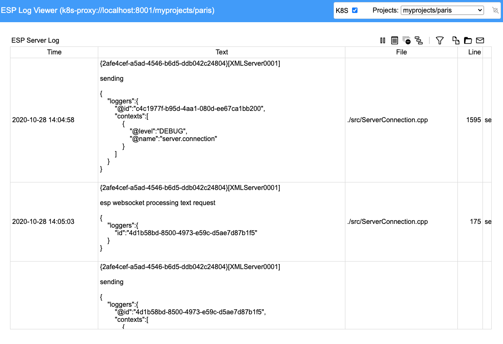

# ESP Connect API

## Table of Contents

* [Overview](#overview)
    * [Prerequisites](#prerequisites)
    * [Installation](#installation)
* [Getting Started](#getting-started)
    * [Starting an HTTP Server](#starting-an-http-Server)
    * [Setting Up Your Page](#Setting-Up-Your-Page)
    * [Examples](#examples)
* [Using The API with Kubernetes](#using-the-api-with-kubernetes)
    * [K8S Introduction](#k8s-introduction)
    * [Using the UI with K8S](#using-the-ui-with-k8s)
        * [Running the Examples](#running-the-examples)
        * [Model Viewer with K8S](#model-viewer-with-k8s)
        * [Log Viewer with K8S](#log-viewer-with-k8s)
* [Webpack](#Webpack)
    * [Introduction](#webpack_intro)
    * [Using with NodeJS](#webpack_nodejs)
    * [Using with Web Pages](#webpack_web)
* [Contributing](#contributing)
* [License](#license)
* [Example Pages](#example-pages)
* [Additional Resources](#additional-resources)

## Overview
The ESP Connect API enables you to communicate with ESP servers from any platform using JavaScript objects. You can easily embed objects within web pages. The objects support [Node.js](http://www.nodejs.org) so that you can run them from the command line.

The API works with standalone ESP servers (started from the command line) as well as with the [SAS Event Stream Processing Kubernetes Cloud
Ecosystem](https://github.com/sassoftware/esp-kubernetes/tree/develop).

**NOTE** While ESP Connect should work with an SAS Event Stream Processing 6.2 server, it was designed specifically to work with the SAS Event Stream Processing 2020.x WebSocket interface.

The ESP Connect API leverages the new ESP WebSocket API, which uses the following connection request:
```
ws://espsrv01:7777/eventStreamProcessing/v1/connect
```
The lower-level details of the WebSocket communications are hidden from whoever is using the API.

The API includes both objects used for communication as well as graphical objects used to display data.

Some of the graphical features include the following:
* Charts (built on [Plotly](https://plot.ly/javascript))
    * Bar Charts
    * Line Charts
    * Pie Charts
    * Radar Charts
    * Polar Charts
    * Bubble Charts
    * Time Series
    * Geographic Maps
        * Leaflet based maps (built on [Leaflet](https://leafletjs.com))
        * Plotly based maps (built on [Plotly](https://plotly.com/javascript/maps))
        * Choropleth maps (built on [Plotly](https://plotly.com/javascript/choropleth-maps))
    * Gauges
    * Compasses
    * Image Viewers
    * Tables
* ESP Model Viewers (built on [vis.js](https://visjs.org)) provide the ability to
    * Visualize the directed graphs used by ESP models.
    * Monitor server memory usage (system, virutal, and resident).
    * Monitor CPU usage on a per window basis as events stream through the models
    * Publish events into ESP models
    * See different window attributes including
        * CPU Usage
        * Event Count
        * Window Type
        * Window Schema
        * Index Type
* ESP Log Viewers provide the ability to 
    * See the ESP server log in realtime over a websocket interface
    * View and set the logging levels in the server
    * Copy the log to the clipboard
    * Filter the logs

You can read more about these visuals <a href="doc/visualizations.md" target="_blank">here</a>.

There is a full set of examples that you can use to get started with the API.

If the connection to the ESP server is lost, then all graphics should be cleared and the system should automatically begin attempting to reconnect. When the connection
is reestablished, the visualizations should continue displaying the data.

### Prerequisites

In order to run the ESP Connect command-line utilities, you must have [Node.js](https://nodejs.org) (at least version 12.x) and [Node Package Manager](https://www.npmjs.com) installed on your system.

### Installation

After you have cloned this repository you can use the API to develop web pages. If you want to use the NodeJS support
in the API, you must perform an *npm install* of the ESP Connect API (the *work* directory is where you cloned the API):
* Change to your HOME directory.
* Install the ESP Connect API from the directory where you cloned it (the module name is <i>esp-connect</i>):
```
$ npm install @work@/js/connect
```
* Change directory to *@work@/node*.
* Run a test using the following command (use your own ESP server):
```
$ node model.mjs --server http://espsrv01:7777
```

## Getting Started

### Starting an HTTP Server
Because this API includes graphical elements, you need an HTTP server to support this capability. You can use any HTTP server, but for simplicity and demonstration purposes 
the <a href="https://www.npmjs.com/package/http-server" target="_blank">NodeJS HTTP server</a> is used in the following steps.

To set up the NodeJS HTTP server with the ESP Connect API:
* Clone the ESP Connect API into a working directory, *@work@*
* Change directory to @work@
* Start the HTTP server (here, use port 33000):
```
$ http-server --port 33000
```

After the HTTP server is running, you can develop web pages. 
 
Depending on the API features that you want to use, you should add certain declarations to the head section of the page.

**NOTE** The following HTML fragments assume that the pages reside two levels below the working directory. Your pages can reside anywhere on your server, such that the 
relative paths change accordingly.

### Setting Up Your Page
If you want to use the basic charting capabilities, you should include the Plotly declarations:
```html
<script src="https://cdn.plot.ly/plotly-latest.min.js" charset="utf-8"></script>
```

If you want to use the leaflet geographic map visualization, include the leaflet declarations:
```html
<link rel="stylesheet" href="https://cdnjs.cloudflare.com/ajax/libs/leaflet/1.7.1/leaflet.css" integrity="sha512-xodZBNTC5n17Xt2atTPuE1HxjVMSvLVW9ocqUKLsCC5CXdbqCmblAshOMAS6/keqq/sMZMZ19scR4PsZChSR7A==" crossorigin="anonymous" />
<script src="https://cdnjs.cloudflare.com/ajax/libs/leaflet/1.7.1/leaflet.min.js" integrity="sha512-SeiQaaDh73yrb56sTW/RgVdi/mMqNeM2oBwubFHagc5BkixSpP1fvqF47mKzPGWYSSy4RwbBunrJBQ4Co8fRWA==" crossorigin="anonymous"></script>
```

If you want to use the model viewer visualizations, include the vis.js declarations:
```html
<script src="https://visjs.github.io/vis-network/standalone/umd/vis-network.min.js"></script>
```

The following code must be added to bring in the ESP Connect API:
```html
<script type="text/javascript">
var _esp = null;
</script>

<link rel="stylesheet" href="../../style/connect.css" />
<script type="module">
import {esp} from "../../js/ui/api.js";
_esp = esp;
</script>
```

**NOTE** The locations of the files depend on the location of your page.

Now invoke some kind of *init* method after your page is loaded:
```html
<body onload="init()">
...
</body>
```

As an example, consider a web page that displays some colored areas and publishes events into a model whenever a user clicks in those areas. The *init* function
might look like the following (be sure to enclose in the &lt;script&gt; tag):

```javascript
var _conn = null;
var _visuals = null;

function
init()
{
    _visuals = _esp.createVisuals(parms);
    _esp.handleLayout({layout:layout});

    var  model = "<project threads='4' pubsub='auto'>\
                   <contqueries>\
                     <contquery name='cq'>\
                       <windows>\
                         <window-source name='clicks' insert-only='true' index='pi_EMPTY'>\
                            <schema-string>id*:string,element:string,x:int32,y:int32</schema-string>\
                         </window-source>\
                         <window-copy name='copy'>\
                            <retention type='bytime_sliding'>30 seconds</retention>\
                         </window-copy>\
                         <window-aggregate name='clicksAggr'>\
                            <schema-string>element*:string,count:int32</schema-string>\
                            <output>\
                                <field-expr>ESP_aCount()</field-expr>\
                            </output>\
                         </window-aggregate>\
                       </windows>\
                       <edges>\
                         <edge source='clicks' target='copy' />\
                         <edge source='copy' target='clicksAggr' />\
                       </edges>\
                     </contquery>\
                   </contqueries>\
                </project>";

    _esp.showStatus("Loading project...");

    _esp.connect("http://espsrv01:2222",{ready:ready,error:error},{model:{name:"myproject",data:model},overwrite:true,force:_esp.getParm("force",false)});
}

function
ready(connection)
{
    _esp.clearStatus();
    _conn = connection;
    ...
}

```

This function creates a connection to an ESP server. You must provide a connection delegate to the connect call so that the the system can notify you when the connection has
been established. The connection delegate can implement the following methods:

* *ready* - invoked when the connection has been established and the handshake is complete
* *closed* - invoked when the connection has closed

Notice that the function also includes a simple model to load upon establishment of the connection. Whenever a project is specified in the connect call, the *ready* function
is not called until the project is loaded.

The function also creates a Visuals object to be used later in creating the visualizations.

Now add a couple of visualizations to the page in the *ready* function:

```javascript
function
ready(connection)
{
    _esp.clearStatus();
    _conn = connection;

    _conn.getEventCollection({window:"myproject/cq/clicksAggr"}).then(
        function(collection) {
            _visuals.createBarChart("barchart",collection,{y:"count",header:"Clicks Chart",xrange:[0,100],orientation:"horizontal",get_color:barcolor});
            _visuals.createGauge("gauges",collection,{value:"count",segments:5,header:"Clicks Indicators",width:200,range:[0,100],bar_color:"rgba(255,255,255,.7)"});
        }
    );
}
```

**NOTE** If you are working with a server that already has a model loaded, you might not need to go through the load process.

## Using The API with Kubernetes
### K8S Introduction
You can use the ESP Connect package in a Kubernetes (K8S) environment. First you must create the SAS Event Stream Processing K8s ecosystem described
<a href="https://github.com/sassoftware/esp-kubernetes/tree/develop" target="_blank">here</a>.

You need to communicate with a K8S API server in order to perform operations such as project creation and deletion. The preferred way to do this is to use a 
<a href="https://kubernetes.io/docs/tasks/extend-kubernetes/http-proxy-access-api" target="_blank">K8S proxy server</a>.

The proxy server enables web-based components to communicate with K8S without experiencing issues with CORS (Cross Origin Resource Sharing).

**NOTE** You must download and install the <a href="https://kubernetes.io/docs/tasks/tools/install-kubectl" target="_blank">kubectl</a> command to 
run the proxy as well as perform other K8s-related tasks.

Use the kubectl command to start the proxy. The following command starts a proxy that can be used to serve up the ESP Connect web-based components. These components include the examples, the model viewer, and the log viewer.
```javascript
$ kubectl proxy --www=@work@/esp-connect --www-prefix=/esp-connect --accept-hosts=".*" --disable-filter --v=7
```
The proxy reads your K8S configuration so it handles the authentication with the API server. You can communicate directly with the server (from command line, not a web page) but you must provide any necessary authentication information.

ESP server connections are initiated with URLs. For example, to retrieve the model for project Trades from an ESP server that runs on espsrv01 at port 2222:
```
$ node model --server http://espsrv01:2222 --name trades
```
Because this command points directly to an ESP server, it does not suffice in a K8S environment.
You can use the following protocols to communicate with ESP servers in a K8S cluster.
* k8s: - protocol to go directly to a K8s API server.
```
$ node model --server k8s://10.104.16.129:6443/myns/trades
```
* k8s-proxy: - protocol to go to a K8s proxy server.
```
$ node model --server k8s-proxy://localhost:8001/myns/trades
```
The K8s URL contains the host and port of the K8s server (or proxy) and, optionally, the K8s namespace and project name.
The different protocols are necessary because communications with the proxy server do not use Transport Layer Security (TLS), whereas those with the API server do use it.

Using these protocols tells the ESP Connect API that it is working with K8s. This enables the API to send any necessary requests to the
K8s server.

### Using the User Interface with K8S
#### Running the Examples
When you set up your K8s ESP environment, you specify a K8s namespace. Suppose you use a namespace called *myprojects* for demonstration
purposes. When you have run the setup scripts and have created that namespace, you can run the connect examples by specifying the
namespace in the URL. (The following command uses a local proxy server):
```
http://localhost:8001/esp-connect/examples/?namespace=myprojects
```

So when you bring up that page in a browser, the examples use the specified K8s namespace to load and execute the necessary models
for the examples.

#### Model Viewer with Kubernetes
The Model Viewer has a checkbox in the upper right corner.


When you select this checkbox, you go into K8s mode. This means that you do not connect directly to a standalone ESP server. The *Projects* dropdown
is populated with all of the projects that reside in the K8s cluster (format is *namespace/project*). To switch between projects, select the desired project from the dropdown and the API communicates with K8s to get the model and display it.

To return to standalone server mode, uncheck the checkbox. You are prompted for a standalone ESP server URL. 

#### Log Viewer with Kubernetes
The log viewer has a checkbox in the upper right corner.



When you select this checkbox, you go into K8s mode. This means that you do not connect directly to a standalone ESP server. There is also a  *Projects* dropdown
in the upper right corner In K8s mode it is populated with all of the projects that reside in the K8s cluster (format is *namespace/project*). 
To switch between projects, select the desired project from the dropdown and the API communicates with K8s to get the log and display it.

To return to standalone server mode, uncheck the checkbox. You are prompted for a standalone server URL.

### Examples

#### More Documentation
##### [API Objects](doc/api.md)
##### [Using Visuals](doc/visualizations.md)
##### [Using Connect with Node.js](doc/nodejs.md)
##### [The Javascript Router](doc/jsrouter.md)

#### Examples
The following examples contain the features described in this README file. Start an empty ESP server, because the
examples load specific projects. 
* [basic](doc/examples/basic.txt) - basic Connect API usage
* [geofence](doc/examples/paris.txt) - geofence example with trip through Paris
* [weather](doc/examples/weather.txt) - weather data example using gauges and compasses
* [sailing](doc/examples/sailing.txt) - geofence example with sailboats
* [turbines](doc/examples/turbines.txt) - example of custom graphics displaying streaming data from wind turbines
* [trades](doc/examples/trades.txt) - streaming stock trades and broker violations

You can run these and other examples by

1. Downloading the ESP Connect API into your work area, @work@
2. Make @work@ accessible to a web server
3. Navigate to http://@work@/examples in your browser providing a *server=http://myserver:5555* parameter (use your own server)

## Webpack
### <a name="webpack_intro">Introduction</a>
Webpack is a module bundler for Javascript. It enables you to bundle ESP Connect components into fully self-contained bundles that
can be used from either a web page or from NodeJS.

There are two bundles that you can use with ESP Connect:
* <a href="https://github.com/sassoftware/esp-connect/blob/master/dist/esp-connect-api.js" target="_blank">esp-connect-api.js</a> - The bundle containing just the ESP Connect API objects to be used with NodeJS.
* <a href="https://github.com/sassoftware/esp-connect/blob/master/dist/esp-connect-ui.js" target="_blank">esp-connect-ui.js</a> - The bundle containing both the ESP Connect API objects and the visualization objects to be used to create web pages.

You can use the bundles directly without having to download and install the ESP Connect package. Simply save them somewhere and reference them.

### <a name="webpack_nodejs">Using with NodeJS</a>
To use the Webpack bundle with NodeJS, you need to take slightly different steps from those you take when using the installed version. 

When you are using the installed version, you bring in the API like this:

```javascript
import {connect as esp} from "@sassoftware/esp-connect";
```

When you are using Webpack, use the following code to load the ESP Connect API. (You must have downloaded the bundle to /tmp.):
```javascript
import {default as connect} from "/tmp/esp-connect-api.js";
var esp = connect.api;
```

With this small change at the top of the code, the rest of the program should operate as it normally would.

### <a name="webpack_web">Using with Web Pages</a>
Using Webpack with web pages also requires slightly different steps from those you take to use the installed version.

When you are using the installed version, the top of your page includes code similar to the following:
```javascript
<script type="text/javascript">
var _esp = null;
</script>

<!-- Run from an esp-connect install -->
<link rel="stylesheet" href="../../style/connect.css" />
<script type="module">
import {esp} from "../../js/ui/api.js";
_esp = esp;
</script>
```

When you are using Webpack, change this code to something like the following. (You must have downloaded the bundle to same directory as your page.):
```javascript
<!-- Run from an esp-connect webpack bundle (you can put the bundle anywhere) -->
<script type="text/javascript" src="./esp-connect-ui.js"></script>
<script type="text/javascript">
_esp = esp_connect_ui.api;
</script>
```

With this small change at the top of the page, the rest of your page should operate as it normally would.

## Contributing

> We are not currently accepting contributions.

## License

> This project is licensed under the [Apache 2.0 License](LICENSE).

## Additional Resources

* [SAS ESP](https://www.sas.com/en_us/software/event-stream-processing.html)
* [SAS ESP User Guide](https://go.documentation.sas.com/?cdcId=espcdc&cdcVersion=6.2&docsetId=espov&docsetTarget=home.htm&locale=en)
