# ESP Connect Visualizations
## Table of Contents
* [Overview](#Overview)
* [Creating Charts](#Creating-Charts)
    * [Bar Charts](#Bar-Charts)
    * [Line Charts](#Line-Charts)
    * [Time Series](#Time-Series)
    * [Pie Charts](#Pie-Charts)
    * [Bubble Charts](#Bubble-Charts)
    * [Gauges](#Gauges)
    * [Compasses](#Compasses)
    * [Maps](#Maps)

## Overview
The ESP Connect API allows you to create many types of visualizations to be used to display ESP information.

The *Visuals* object is used to create all the charts, tables, and viewers in the Connect API. You can create instances of this object by 
using the API handle delivered upon startup:
```javascript

var _visuals = null;

function
init
{
    ...
    _visuals = _esp.createVisuals(_esp.getParms());
    ...
}

...

<body onload-"init()">
...

```
You can specify initialization options when you create the Visuals instance. In the above example, the code passes the URL request parameters 
directly into the call to create the instance.

The option parameters you can specify when creating the Visuals instance are:
* *theme* - the color theme (explained below).
* *colors* - a list of colors in string format, i.e. ["#89cff0","#0080ff","#f0bd27","#ff684c","#e03531"].
* *font* - the font to use for graphics, defaults to the font used in the page.
* *title_font* - the font to use for graphics headers, defaults to the font used in the page.
    
You can optionally specify a color theme for the instance upon creation. These colors are used to render any of the graphics 
created by the instance.

The theme can be either of 2 types:

* **SAS Color Themes**
    * sas_base
    * sas_corporate
    * sas_dark
    * sas_highcontrast
    * sas_ignite
    * sas_inspire
    * sas_light
    * sas_marine
    * sas_midnight
    * sas_opal
    * sas_sail
    * sas_snow
    * sas_umstead
    * sas_hcb


* **Plotly color scales**
    * Blackbody
    * Bluered
    * Blues
    * Earth
    * Electric
    * Greens
    * Greys
    * Hot
    * Jet
    * Picnic
    * Portland
    * Rainbow
    * RdBu
    * Reds
    * Viridis
    * YlGnBu
    * YlOrRd

The call to create the Visuals instance might look like this:
```
function
esp(api)
{
    _esp = api;
    var parms = _esp.getParms();
    _visuals = _esp.createVisuals(parms);
}
```

## Creating Charts
It is very easy to include charts in the web page once you have your server connection active and have created your Visuals instance. You 
invoke the appropriate chart creation method, and then use the name of the chart when and where you want to display it:
```
var alerts = conn.getEventCollection({window:"myproject/cq/alerts"});
visuals.createBarChart("barchart",alerts,y=["total","restrictedTrades"])
```
The different chart types will have different options specified in the option parameters. However, all charts will have the following options:
* *header* - the chart header text

### Bar Charts
A bar chart can plot numeric variables on an x and y axes. 

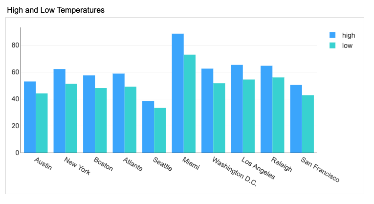

They are created like this:
```
var temps = conn.getEventCollection({window:"myproject/cq/temperatures"});
var tempChart = visuals.createBarChart("mychart",temps,{y:["high","low"],header:"Temperature Chart"})
```
The first parameter is the id of the div in which the chart is to be drawn.

The second parameter is the datasource (event collection or event stream).

The option parameters are:
* *x* - an optional array of classification field values to display on the x or y axis (depending on orientation). If this is not specified, the event key values are used.
* *y* - an array of numeric field values to display on the x or y axis (depending on orientation)
* *orientation* - the orientation of the bar chart, vertical (default) or horizontal

### Line Charts
A line chart can plot numeric variables on the y axes. 

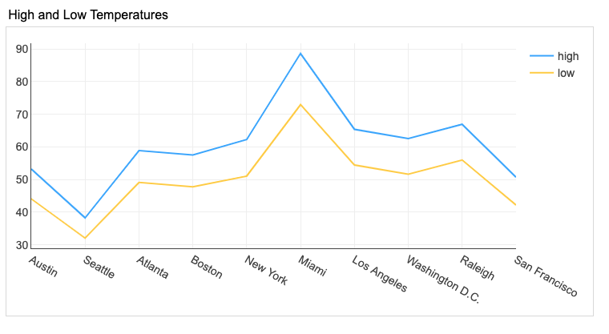

They are created like this:
```
var temps = conn.getEventCollection({window:"myproject/cq/temperatures"});
var tempChart = visuals.createBarChart("mychart",temps,{y:["high","low"],header:"Temperature Chart"})
```
The first parameter is the id of the div in which the chart is to be drawn.

The second parameter is the datasource (event collection or event stream).

The option parameters are:
* *x* - an optional array of classification field values to display on the x or y axis (depending on orientation). If this is not specified, the event key values are used.
* *y* - an array of numeric field values to display on the x or y axis.
* *line_width* - the width of the lines in the chart, in pixels (defaults to 2)
* *curved* - if this is true, the lines will be curved, otherwise, they will be straight
* *fill* - if this is true, the lines will be filled underneath, otherwise, they will not

### Time Series
A time series can plot numeric variables on the y axis with a date or time variable on the x axis.

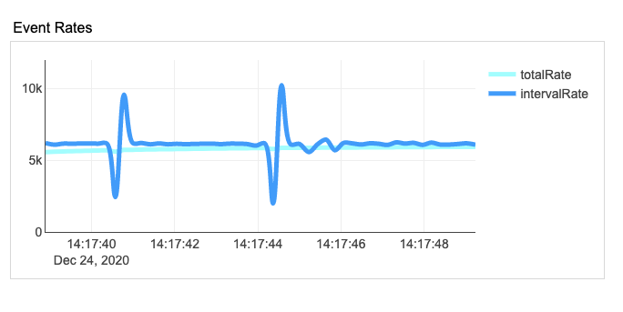

They are created like this:
```
var rate = conn.getEventStream({window:"myproject/cq/rates"});
visuals.createTimeSeries("rates",eventRate,{time:"timestamp",y:["totalRate","intervalRate"],header:"Event Rate"})
```
The first parameter is the id of the div in which the chart is to be drawn.

The second parameter is the datasource (event collection or event stream).

The option parameters are:
* *time* - A field value of type Date or Timestamp.
* *y* - an array of numeric field values to display on the x or y axis.
* *line_width* - the width of the lines in the chart, in pixels (defaults to 2)
* *curved* - if this is true, the lines will be curved, otherwise, they will be straight
* *fill* - if this is true, the lines will be filled underneath, otherwise, they will not

### Pie Charts
A pie chart can represent a numeric value as a *slice* of pie.

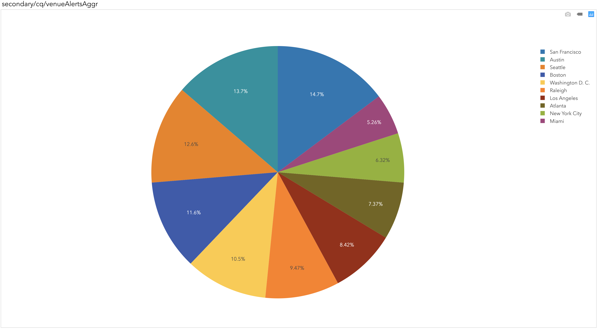

They are created like this:
```
var alerts = conn.getEventCollection({window:"myproject/cq/alerts"});
visuals.createTimeSeries("piechart",alerts,{value:"total"],header:"Venue Alerts"})
```
The first parameter is the id of the div in which the chart is to be drawn.

The second parameter is the datasource (event collection or event stream).

The option parameters are:
* *value* -  the field value to display in the pie

### Bubble Charts
A bubble chart can represent multiple numeric values as y, size, and color visualizations.

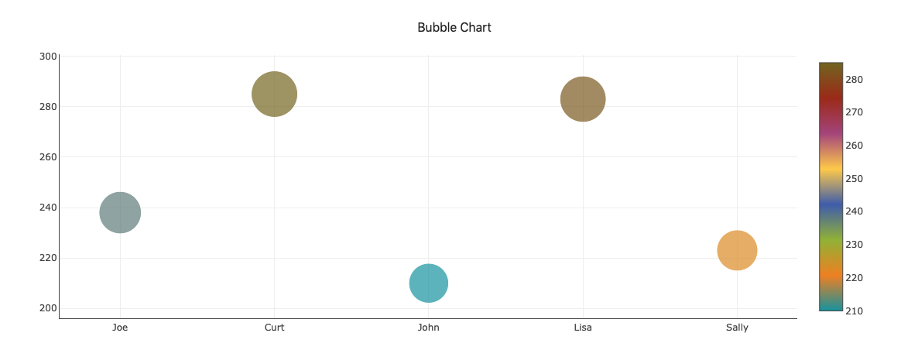

They are created like this:
```
var alerts = conn.getEventCollection({window:"myproject/cq/alerts"});
visuals.createBubbleChart("brokerAlerts",alerts,{y:"restrictedTrades",size:"total",color:"frontRunningSell",header:"Broker Alerts"})
```
The first parameter is the id of the div in which the chart is to be drawn.

The second parameter is the datasource (event collection or event stream).

The option parameters are:
* *x* - an optional array of classification field values to display on the x axis. If this is not specified, the event key values are used.
* *y* - the field value to display on the y axis
* *size* - the field value to use for the size of each bubble
* *color* - the field value to use for the color of each bubble

### Maps

The map chart is uses [Leaflet](https://leafletjs.com/) to display a geographic map overlaid with markers representing event data.
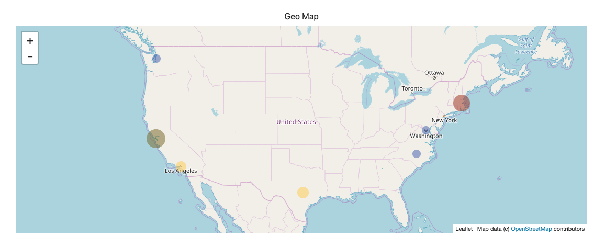
You can specify data fields for size and color of the markers.

The map chart also has the ability to display custom shapes on the map. These shapes can be either circles or polygons.

To add a circle you must call the *addCircles* method with an EventCollection object containing events with the circle data 
and the following option parameters:
* *lat* - the field representing the latitude of the circle
* *lon* - the field representing the longitude of the circle
* *radius* - the field representing the radius of the circle
* *text* - the optional field containing text to display if the user clicks on the circle

To add a polygon you must call the *addPolygons* method with an EventCollection object containing events with the shape data
and the following option parameters:
* *coords* - the field containing a space-separated list of latitude/longitude points in the polygon.
* *text* - the optional field containing text to display if the user clicks on the polygon.
* *order* - the optional specifying the sequencing of the points. If this is *lat_lon* (default), then the points are in latitude/longitude order.
If this is *lon_lat*, then the points are in longitude/latitude order.

The following example displays a map of Paris and adds custom shapes to it:
```
var paris = visuals.createMap("paris",tracker,{lat:"GPS_latitude",lon:"GPS_longitude",size:10,color:"speed",color_range:[0,50],
                                header:"Paris",popup:["vehicle","speed"],marker_border:false,
                                colors:["#e03531","#ff684c","#f0bd27","#51b364","#8ace7e"],
                                zoom:15,tracking:true,center:[48.875,2.287583]})

paris.addCircles(circles,{lat:"POI_y",lon:"POI_x",radius:"POI_radius",text:"POI_desc"})
paris.addPolygons(polygons,{coords:"poly_data",text:"poly_desc",order:"lon_lat"})
```
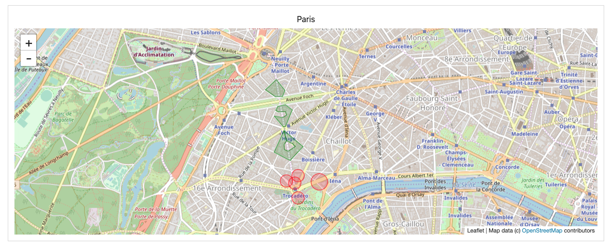

They are created like this:
```
var venueAlerts = conn.getEventCollection({window:"p/cq/venueAlertsAggr"});
visuals.createMap("venueAlerts",venueAlerts,{lat:"lat",lon:"lon",size:"count",color:"count",header:"Venue Alerts"})
```
The first parameter is the id of the div in which the chart is to be drawn.

The second parameter is the datasource (event collection or event stream).

The option parameters are:
* *lat* - the field value that contains the latitude.
* *lon* - the field value that contains the longitude.
* *size* - either the field value to use to derive the size of each marker, or a numeric value for fixed size markers.
* *color* - either the field value to use to derive the color of each marker, or a fixed color.
* *colormap* - the color theme to use to color markers (use this or *colors*).
* *colors* - a list of colors to use to color markers, i.e. ["#89cff0","#0080ff","#f0bd27","#ff684c","#e03531"] (use this or *colormap*).
* *color_range* - the start and end values against which the data values are compared to derive a color. If this is not set, the min and max
* *data* values are used as the range.
* *popup* - the field values to display when the user clicks on a marker.
* *marker_border* - a boolean value determining whether markers have borders.
* *marker_opacity* - a value between 0 and 1 determining marker opacity.
* *zoom* - a value between 1 and 18 for the initial zoom value for the map (defaults to 12).
* *center* - a lat/lon pair to use as the center of the map (defaults to (0,0)).
* *tracking* - a boolean value determining whether the map will move itself such that the initial marker is always in the center.
* *circle_border_width* - a numeric value specifying the width of circle borders, in pixels, defaults to 1.
* *circle_border_color* - the color to use for circle borders, defaults to black.
* *circle_fill_color* - the color to use for circle interiors, defaults to white.
* *circle_fill_opacity* - a numeric value specifying the opacity of circle interiors, defaults to .2.
* *poly_border_width* - a numeric value specifying the width of polygon borders, in pixels, defaults to 1.
* *poly_border_color* - the color to use for polygon borders, defaults to black.
* *poly_fill_color* - the color to use for polygon interiors, defaults to white.
* *poly_fill_opacity* - a numeric value specifying the opacity of polygon interiors, defaults to .2.

### Gauges
A gauge displays a single numeric value in a graphic divided into segments.
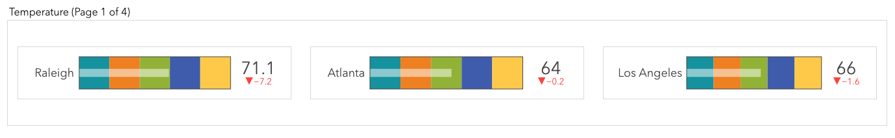
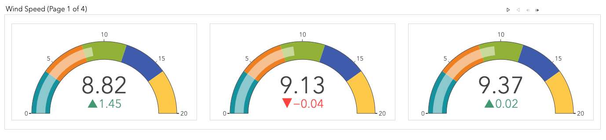
For each event, a gauge is displayed showing the specified numeric value of the event along with a pointer
showing where that value lies in the specified range of the gauge. The key value of the event is displayed
at the top of the gauge along with the current gauge value.

The gauge colors can be specified in a couple ways. You can specify a *color* value which will be used as the color of leftmost segment. The rest of
the segments will be colored with an increasingly darker shade of this color. You can also specify a *colors* value which contains a color palette
which will be displayed in the segments, left to right.

They are created like this:
```
var colors = ["#8ace7e","#51b364","#f0bd27","#ff684c","#e03531"];

visuals.createGauge("windspeed",speed,{segments:5,value:"total",size:300,range:[0,1000],colors:colors,shape:"bullet",header:"Wind Speed"})
```

The first parameter is the id of the div in which the chart is to be drawn.

The second parameter is the datasource (event collection or event stream).

The option parameters are:
* *segments* - the number of segments to display in the gauge, defaults to 3.
* *value* - the field value that contains the numeric value to display in the gauge.
* *size* - the pixel size of the gauge, defaults to 300.
* *shape* - the shape of the graphic, either *bullet* or *gauge*, defaults to *gauge*.
* *range* - the start and end values for the range displayed in the gauge, defaults to (0,100).
* *color* - the color to use for the leftmost segment in the gauge with the rest of the segments colored with a darker gradient of this value.
* *colors* - the colors to display in the gauge.
* *line_width* - the pixel width of the lines used to draw the gauge.
* *delta* - a boolean value determining whether to display the change in values.

### Compasses
A compass displays a numeric value which represents a navigational heading.

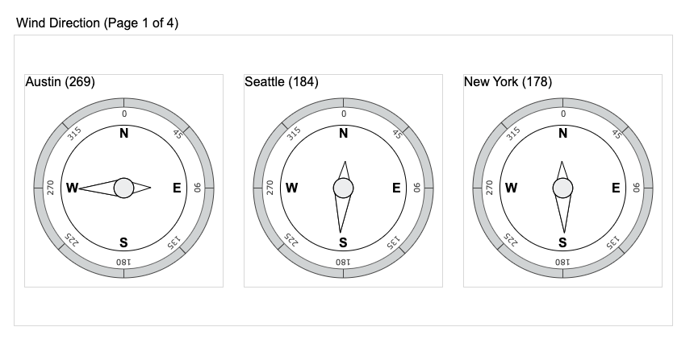

They are created like this:
```
visuals.createCompass("heading",heading,{heading:"total",size:300,heading:"Compass"})
```
The first parameter is the id of the div in which the chart is to be drawn.

The second parameter is the datasource (event collection or event stream).

The option parameters are:
* *heading* - the field value that contains the navigational heading to display in the compass.
* *size* - the pixel size of the gauge, defaults to 300.
* *heading_color* - the color to use for the heading arrow, defaults to the the darkest theme color.
* *reciprocal_color* - the color to use for the opposite arrow angle, defaults to the the lightest theme color.
* *bg_color* - the color to use for the center of the compass, defaults to the middle of the color theme.
* *outer_color* - the color to use for the outer circle of the compass, defaults to the middle of the color theme.
* *line_width* - the pixel width of the lines used to draw the compass, defaults to 1.

### Tables
A table can display any number of event fields. If you have an event field containing an image, the image will be displayed in the table. If the event
has object detection information within it, the objects will be labelled inside the image.
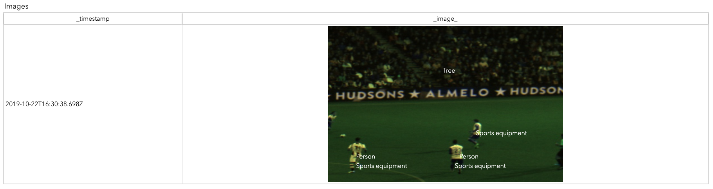

You can also apply a gradient color to the table rows depending on the value of a certain field.

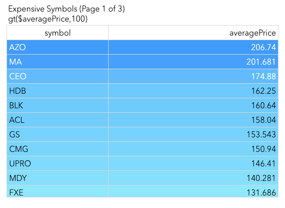

They are created like this:
```
visuals.createTable("symbols",expensiveSymbols,{values:["brokerName","total","restrictedTrades"],header:"Expensive Symbols"})
```
**NOTE:** If you do not specify a *values* parameter, all event fields are displayed.

The first parameter is the id of the div in which the chart is to be drawn.

The second parameter is the datasource (event collection or event stream).

The option parameters are:
* *values* - The event values to display in the table, defaults to ALL
* *reversed* - a boolean value determining whether to add the most recent events to the beginning or end of the table, defaults to false.
* *image_width* - The width of images included in the table
* *image_height* - The height of images included in the table
* *color* - The numeric field to use to color the rows of the table
* *base_color* - The base color to use when coloring the table rows, defaults to the lightest theme color

## Creating Other Visualizations
You can also create visualizations other than those used to display ESP event data. These include visualizations to dynamically monitor ESP models and
to view the live ESP server log.

### Model Viewer
The model viewer is a graphical representation of the ESP model in the form of a directed graph. 

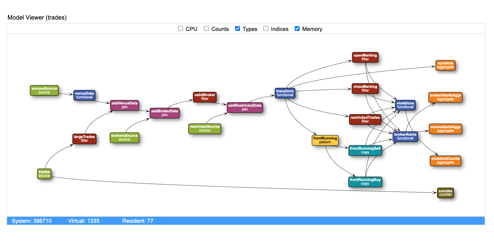

You can optionally view many attributes of each window, some of which are dynamic and some of which are static. These properties include:
* *type* - the ESP window type</li>
* *index* - the ESP index type</li>
* *cpu* - the CPU usage of the window (dynamic, changes as events are flowing through the model)</li>
* *count* - the number of events currently in the window (dynamic, changes as events are flowing through the model)</li>
* *schema* - the window schema (this sometimes makes the graph nodes very large)</li>
In addition to window information, the model viewer displays ESP server memory usage information. The system memory, virtual memory, and resident memory
information is displayed above the directed graph. This information is dynamic and changes as the model is processing the event stream.

You create a model viewer like this:
```
var viewer = visuals.createModelViewer("model",conn,{cpu:true,counts:true,type:false,index:false});
```
The first parameter is the id of the div in which the chart is to be drawn.

The second parameter is the connection to the ESP server.

The option parameters are:
* *cpu* - show CPU usage?</li>
* *counts* - show event counts?</li>
* *type* - show window type?</li>
* *index* - show window index type?</li>
* *schema* - show window index type?</li>
* *cpu_color* - color the nodes according to CPU usage with a color gradient beginning at this color</li>

**NOTE:** All of these boolean options default to false which means the graph displays just the window name by default.

By default the model viewer displays all projects in the ESP server. However, if you want to focus on an individual project, you can specify that before
displaying the model viewer:
```
var viewer = visuals.createModelViewer("viewer",conn,{cpu:true,counts:true,type:false,index:false,cpuColor:true});
viewer.project = "primary";
```

### Log Viewer
The log viewer allows you to watch the live ESP server log. 


You will see the messages at the same time they come out to the real ESP server console. 

You create a model viewer like this:
```
visuals.createLogViewer(conn,{filter:"ERROR"});
```

The first parameter is the id of the div in which the chart is to be drawn.<br/>

The second parameter is the connection to the ESP server.<br/>

The option parameters are:

* *filter* - the filter to use on log entries.

## Laying Out Visualizations
Since all you need to render the visualizations provided in this package is an HTML DIV, you can lay out your pages in any manner you desire.
However, the [Flexbox Layout](https://css-tricks.com/snippets/css/a-guide-to-flexbox) makes it very easy to create a simple
page that will have a responsive behavior and will present your visuals in an optimal fashion.

All of the Connect API examples use this layout mechanism. Also, the package provides some sizing support for a standard layout through the esp.size() method.

As an example, we will look at the body of the *symbols* example.
```
<body>

    <div id="banner">
        <table style="width:100%" cellspacing="0" cellpadding="0">
            <tr>
                <td>ESP Symbols Example</td>
                <td class="icon"><a class="icon" href="javascript:publish()"></a></td>
            </tr>
        </table>
    </div>

    <div id="content">
        <div class="container">
            <div id="cheapBar" class="component" style="width:60%;height:400px"></div>
            <div id="cheapTable" class="component" style="width:30%;height:400px"></div>
            <div id="expensiveBar" class="component" style="width:60%;height:400px"></div>
            <div id="expensiveTable" class="component" style="width:30%;height:400px"></div>
        </div>
    </div>

    <div id="publish" style="display:none">
        <input type="button" value="Publish"></input>
    </div>

    <div id="footer"> </div>

</body>
```
The page has 3 components:
* *banner* - this is the top part of the page that can display title info, contain icons, ...
* *content* - this is the content of the page containing the visualizations. This contains one or more containers.
* *footer* - this is the bottom part of the page that can display messages, status ...

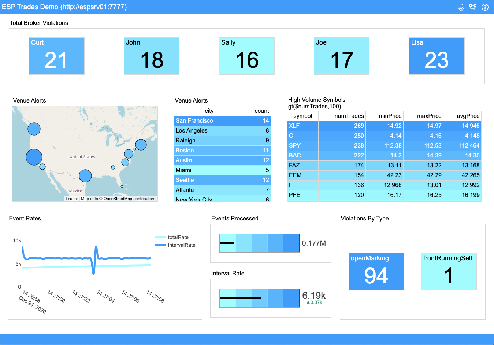
